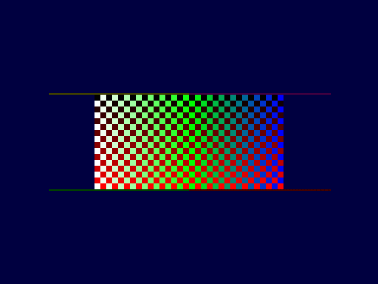
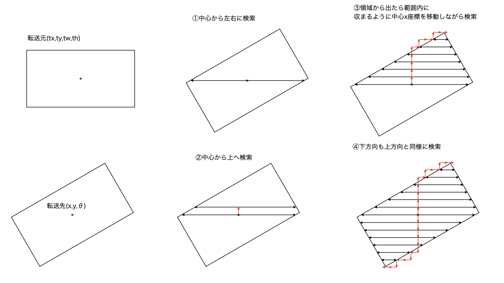

# 回転拡大縮小アルゴリズム研究

FPGAで回転拡大縮小機能を作るための研究用プロジェクトです。
pythonとpygameで実装してみてます。

### [rot2.py](rot2.py)

拡大縮小を描画元領域の中心から上下に検索して、さらに左右に描画をして領域を出た段階で終了させます。
描画元で検索に失敗した箇所を薄く描画してますが、検索ロスが少ないことがわかるはずです。

検索領域をより狭めれば良いのですがガタつくのでこのようなアルゴリズムを考えました。

### [rot3.py](rot3.py)

rot2.py を改良して、描画した領域の左右を持っておき、上下の位置はその領域内を検索するようにしました。
より検索する領域は限定されるので高速化されているはずです。

### [rot4.py](rot4.py)

rot3をリファクタリング

転送元の矩形と転送先の中心と回転角からx,y座標を横に移動して描画し、上に１ドット移動して左右に描画を繰り返して、描けなくなったら、描画した横幅内で次の開始位置を検索して見つからなくなるまで描画し、下方向にも同様。拡大縮小はdx,dyを変えます。

### [rot5.py](rot5.py)

rot4を関数に分けてリファクタリング

